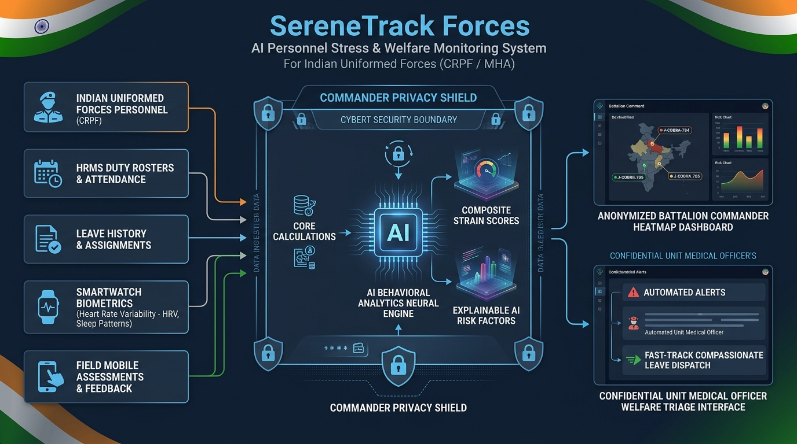

# 🛡️ SereneTrack Forces: AI-Based Predictive Personnel Stress & Welfare Monitoring System

> **Official Solution for Smart India Hackathon (SIH)**  
> **Problem Statement ID**: `26186`  
> **Problem Statement Title**: AI-Based Predictive Personnel Stress and Welfare Monitoring System for Uniformed Forces  
> **Organization**: Ministry of Home Affairs (MHA)  
> **Department**: Central Reserve Police Force (CRPF), Police II Division  
> **Theme**: MedTech / BioTech / HealthTech  

---

## 🌐 Live Deployment & Project Links

| Resource | Link / Access Details |
|---|---|
| 💻 **GitHub Repository** | [https://github.com/psryogeshwar-14/serenetrack-forces](https://github.com/psryogeshwar-14/serenetrack-forces) |
| ⚡ **Live Web Application (Active Now)** | [https://thick-turkeys-invent.loca.lt](https://thick-turkeys-invent.loca.lt) *(Tunnel Password: `103.214.61.125`)* |
| ☁️ **Render Cloud Production Service** | [https://serenetrack-forces.onrender.com](https://serenetrack-forces.onrender.com) |
| 🎬 **Official SIH Video Demo** | *[YouTube Demo Video Link (Paste Link Here)]* |
| 🏥 **Live API Health Check** | [https://thick-turkeys-invent.loca.lt/api/health](https://thick-turkeys-invent.loca.lt/api/health) |
| 📁 **Anonymized HR Dataset Export** | [`/api/forces/export/anonymized-dataset`](https://thick-turkeys-invent.loca.lt/api/forces/export/anonymized-dataset) |

---

## 📋 Executive Overview & Problem Context

Personnel serving in **Central Armed Police Forces (CAPFs - CRPF, BSF, CISF, ITBP, SSB, Assam Rifles)**, the Armed Forces, and State Police operate under extreme physical strain, combat threats, irregular working hours, extended deployments in hostile hardship zones (Left-Wing Extremism / CoBRA in Bastar & Sukma, High-Altitude counter-insurgency in J&K, rapid riot deployment with RAF), prolonged separation from families, and exposure to traumatic events.

Currently, stress identification depends on manual observation and ad-hoc self-reporting, delaying timely psychological and welfare intervention. 

**SereneTrack Forces** is an **AI-powered, offline-first predictive personnel stress and welfare monitoring platform** designed specifically for Indian Uniformed Services. It transforms welfare management from reactive crisis management into a **proactive, preventive, and strictly non-punitive welfare doctrine** while guaranteeing the highest standards of privacy, data protection, and individual dignity.

---

## 📐 Technical Architecture & System Data Flow



### End-to-End Technical Pipeline:
1. **Heterogeneous Ingestion Stream**: Ingests 6 core HRMS administrative parameters (leave history, hardship zones, shift overtimes, night sentries, transfer frequency, training courses) alongside voluntary smartwatch biometrics (HRV rMSSD ms, sleep deficit) and low-bandwidth mobile PSS-10 self-assessments.
2. **Commander Privacy Shield (RBAC Boundary)**: Enforces cryptographic pseudonymization (`J-COBRA-784`), preventing commanders from viewing personal medical records and eliminating workplace stigma.
3. **AI Predictive Behavioral Analytics Engine**: Multi-factor mathematical modeling ($5\text{--}99$ scale) computing Autonomic Strain, Burnout Risk ($2\text{--}99\%$), and Force Operational Readiness ($10\text{--}99\%$) with full Explainable AI (XAI) feature attribution drivers.
4. **Dual Operational Cockpits**:
   - **Battalion Commander View**: Anonymized company heatmaps, battalion readiness percentage, and macro leave backlog distribution.
   - **Unit Medical Officer View**: Unmasked clinical triage matrix, automated early-warning alerts, and 1-click fast-track compassionate leave dispatch.

---

## 🏛️ The 8 Core Expected Solution Pillars (PS #26186)

### 1. 🎖️ Personnel Wellness Monitoring Dashboard
- **Commandant & Unit Commander View**:
  - Real-time Battalion **Force Operational Readiness Index (%)** and average autonomic strain scoring.
  - Formation & Company Stress Heatmaps (Alpha, Bravo, Charlie, Delta Coys) highlighting operational fatigue trends.
  - Leave Backlog Overdue Tracker (identifying personnel separated from families for $>180$ or $>240$ days).
  - Shift Overtime & Night Ambush Burden Distribution ($>11\text{h}$/day or $\ge 4$ consecutive night sentries).
  - **De-Identified Roster**: Individual personnel names and private health journals are replaced by secure anonymized tokens (e.g. `J-COBRA-784`), completely eliminating individual stigmatization.

### 2. 🪖 Mobile-Based Field Wellness & Self-Assessment Application
- **Confidential Field Jawan Mobile App**:
  - Lightweight, responsive field portal operational on smartphones even in low-bandwidth forward posts.
  - **60-Second Tactical Field Check-In**: Sleep in bunk, fatigue index (1–10), subjective affective state, and family contact frequency.
  - Standardized Clinical Assessments: **PSS-10 (Perceived Stress Scale: 0–40)** and Operational Combat Stress screeners.
  - **1-Click Confidential Welfare SOS Button**: Enables jawans to privately request a welfare conversation directly with the Unit Medical Officer / Welfare Subedar, strictly off the disciplinary chain of command.
  - **Tactical Recovery Studio**: Visual 4-4-4-4 Tactical Box Breathing pacer, Cyclic Physiological Sighing, and 1-tap call to **Tele-MANAS (14416)** and **Kiran (1800-599-0019)**.

### 3. 🧠 Predictive Behavioral Analytics Engine
- Automatically parses and identifies high-risk behavioral catalysts:
  - Irregular duty shifts, overtime hours, and consecutive night sentry burdens.
  - Post isolation rating (remote border outpost with limited mobile connectivity).
  - Chronic leave denial/deferral records and family separation duration.
  - Sudden anomalies in voluntary self-assessments or biometrics.

### 4. 📈 Stress and Burnout Risk Prediction Models
- **Multi-Factor Algorithmic Scoring ($0\text{--}100$)**:
  - **Organizational / HRMS Signals**: Hardship Theater (`ZONE_LWE` $+28$, `ZONE_HIGH_ALTITUDE` $+24$, `ZONE_CI_OPS` $+22$, `ZONE_PUBLIC_ORDER` $+16$, `ZONE_PEACE_STATIC` $+4$), Days since home leave ($>200\text{d} \to +26$), Leave rejections ($\ge 2 \to +18$), Shift duration ($>12\text{h} \to +18$).
  - **Voluntary Biometric Telemetry**: Heart Rate Variability (HRV rMSSD $<20\text{ms} \to$ sympathetic overdrive $+22$), Resting Heart Rate ($>86\text{ bpm} \to +12$), Restorative Sleep Deficit ($<4.5\text{h} \to +24$).
  - **Psychological Self-Reporting**: PSS-10 ($\ge 28 \to +20$), Operational Fatigue ($\ge 8/10 \to +16$).
- **Explainable AI (XAI)**: Generates human-readable, transparent rationale for every flagged risk tier (Low, Moderate, Elevated, Critical).

### 5. 🤝 Welfare Intervention Recommendation System
- Automatically generates compassionate, non-punitive recommendations:
  - **Fast-Track 15-Day Compassionate Home Leave**: Automatically triggered when family separation exceeds 200 days with deferred leave requests.
  - **Mandatory 48-Hour Rest & Recuperation (R&R) in Garrison**: Ordered when biometrics indicate acute autonomic exhaustion ($\text{HRV} < 20\text{ms}$, sleep $<4.5\text{h}$).
  - **Duty Roster Rebalance**: Rotation off night sentry / combat patrol to day static or administrative duties.
  - **Rotation to Peace Garrison**: Flagged for jawans with $>20$ consecutive months in extreme hardship theaters.
  - **Unit Peer-Buddy Support System**: Automatic buddy-pair assignment for mutual meal-time check-ins and peer bonding.
  - **Tele-MANAS & Medical Officer Consultation**: Scheduled confidential psychological sessions.

### 6. 🔒 Role-Based Access Control (RBAC) & Privacy Management
- **Strict Role Isolation**:
  - `personnel` (Jawan / NCO): Encrypted, confidential view of own data and self-care tools; zero peer or commander surveillance.
  - `welfare_officer` (Unit Medical Officer / Welfare Subedar): Clinical triage view with identifiable personnel details for medical care, alert resolution, and intervention dispatch.
  - `commander` (Commandant / Company Commander): Aggregate readiness scores and company heatmaps; individual records are de-identified into tokens (`J-COBRA-784`) to uphold the Non-Punitive Welfare Charter.
  - `admin`: Audit logging and HRMS integration synchronization.

### 7. 🚨 Automated Early-Warning Alerts
- Instant real-time alerts dispatched to authorized welfare officers when critical risk thresholds are crossed:
  - **Acute Burnout Risk** ($\text{Strain} \ge 80/100$, $\text{HRV} < 18\text{ms}$).
  - **Severe Leave Deprivation Alert** ($>200$ days without home visit $+ \ge 2$ leave denials).
  - **Circadian Disruption Alert** ($\ge 5$ consecutive night sentry watches).
  - Includes 1-click **Acknowledge** and intervention dispatch workflow.

### 8. 🛡️ Data Anonymization & Secure Storage Mechanisms
- **Non-Punitive Doctrine Encoded in System Architecture**:
  - Pseudonymized identifiers (`J-COBRA-***` / `CRPF-ANON-***`).
  - Differential Privacy ($k$-anonymity $\ge 4$) ensuring company statistics cannot be reverse-engineered to identify individuals.
  - Tamper-evident **Privacy Audit Trail** logging every access event with actor role and resource ID.
  - Offline-first SQLite persistence with fallback JSON store.

---

## ⚡ 1-Click SIH Judge Pitch Demo Theaters

Experience the system instantly through 4 pre-configured operational scenarios tailored for hackathon judges:

1. **🔴 Sukma CoBRA Ambush Patrol (204 CoBRA Battalion - Bastar, Chhattisgarh)**:
   - *Parameters*: Left-Wing Extremism (LWE), 20 months tenure, 220 days since last leave, 2 leave rejections, 14h jungle patrol, 6 consecutive night ambushes, HRV 19ms, sleep 4.2h.
   - *Outcome*: **Critical Strain Score 99/100**, Burnout 99%, triggers Automated Critical Welfare Alert, recommends Fast-Track Compassionate Leave and Mandatory 48h R&R.
2. **🟠 Srinagar Sub-Zero Night Sentry (110 Bn CRPF - Kashmir Valley)**:
   - *Parameters*: Counter-Insurgency & High Altitude, sub-zero cold stress, 185 days no leave, 5 night sentries, sleep 5.0h, HRV 25ms.
   - *Outcome*: **Elevated Strain Score 75/100**, triggers Circadian Duty Rotation and sleep hygiene reset.
3. **🟡 RAF Rapid Riot Order (103 RAF Battalion - Delhi-NCR)**:
   - *Parameters*: Public Order, sudden crowd control mobilization, 14.5h stand-by shift, acute sleep debt 4.8h.
   - *Outcome*: **Moderate-High Strain Score 68/100**, triggers Shift Overtime cap and hydration recovery.
4. **🟢 Static Peace Garrison (50 Bn CRPF - New Delhi)**:
   - *Parameters*: Static guard duty, 30 days since leave, 8h regular shifts, 8.0h sleep, HRV 54ms.
   - *Outcome*: **Low Strain Score 12/100**, Force Readiness 96% (Sustainable Baseline).

---

## 📡 REST API Reference

### Uniformed Forces Endpoints (PS #26186)

| Method | Endpoint | Description |
|---|---|---|
| `GET` | `/api/forces/dashboard` | Aggregated battalion & company analytics, readiness, and heatmaps |
| `GET` | `/api/forces/personnel` | Role-based personnel roster (anonymized for commanders, clinical for doctors) |
| `GET` | `/api/forces/personnel/:id` | Detailed single personnel record with explainable AI drivers |
| `POST` | `/api/forces/assessments` | Submit confidential field self-assessment (PSS-10, fatigue, sleep, mood) |
| `GET` | `/api/forces/alerts` | Active automated early-warning alerts for welfare personnel |
| `POST` | `/api/forces/alerts/:id/ack` | Acknowledge/resolve early-warning welfare alert |
| `GET` | `/api/forces/interventions` | Feed of proactive welfare interventions (leave, R&R, rotation) |
| `POST` | `/api/forces/interventions` | Create or update status of welfare intervention |
| `POST` | `/api/forces/simulate` | Execute 1-click SIH judge demo simulation theaters |
| `GET` | `/api/forces/audit` | Privacy access audit trail log |
| `GET` | `/api/forces/dataset` | Export anonymized HR & deployment JSON dataset (PS #26186) |

### Core Clinical & Copilot Endpoints

| Method | Endpoint | Description |
|---|---|---|
| `GET` | `/api/health` | Health check with PS #26186 metadata |
| `POST` | `/api/ai/copilot` | SereneAI Neuro-Restorative Copilot (Gemini API + Offline Heuristics) |
| `GET` | `/api/profile` | Retrieve user profile & reminder settings |
| `GET` | `/api/logs` | Fetch historical daily wellness logs |
| `GET` | `/api/analytics/trends` | 7-day rolling statistics (average strain, sleep debt) |

---

## 🧪 Automated Testing & Verification

The repository includes a comprehensive, multi-layer test suite:

```bash
# Run all automated test suites (API, SIH Pillars, and Forces PS #26186)
npm test

# Run dedicated Uniformed Forces PS #26186 test suite
npm run test:forces

# Run strategic SIH features test suite
npm run test:sih
```

### Test Coverage Highlights:
- **`test/forces_system.test.js`**: Verifies all 8 pillars of PS #26186:
  - Multi-factor AI predictive stress and burnout engine across extreme hardship zones.
  - Role-based privacy anonymization (verifies commander receives `J-COBRA-784` tokens with masked biometrics).
  - Mobile self-assessment submission and real-time risk recalculation.
  - Automated early-warning alert triggering and acknowledgment.
  - Proactive welfare intervention creation and lifecycle management.
  - 1-Click judge simulation scenarios (CoBRA vs Peace Garrison).
  - Anonymized HR dataset export and privacy audit trail logging.
- **`test/api.test.js`**: Core backend REST API sanity tests.
- **`test/sih_features.test.js`**: CBT-I worry vault, circadian decay, and bilingual engine tests.

---

## 🎬 Smart India Hackathon Demo Video & Presentation Guide

For the official SIH 3 to 5-minute video presentation, follow this precise script and on-screen navigation sequence.

### ⏱️ Recommended 4-Minute Presentation Sequence

| Timestamp | Screen / Visual to Show | What to Click / Demonstrate | Exact Talking Points to Narrate |
|---|---|---|---|
| **0:00 - 0:45** | **Header & SIH Problem Statement Banner** | Point out CRPF logo, Problem Statement ID **26186**, MHA Police II Division. | *"Respected Jury members, personnel in our Central Armed Police Forces—CRPF, CoBRA, BSF, and RAF—operate in intense hardship zones with chronic family separation and sleep deficits. Today, stress detection relies on delayed self-reporting. We present SereneTrack Forces: an AI-powered, predictive stress and welfare monitoring platform built with a strictly non-punitive welfare doctrine."* |
| **0:45 - 1:30** | **⚡ 1-Click SIH Judge Theaters** | Click **🔴 Sukma CoBRA Ambush (204 CoBRA)** button. Watch dials spike. | *"To demonstrate real-time predictive behavior, notice our 1-click operational simulators. When deployed in Sukma, Bastar with 220 days since home leave, 6 night ambushes, and severe HRV drop, our engine predicts an Autonomic Strain of 99/100 and Burnout Risk of 99%. Now click 🟢 Static Peace Garrison—strain instantly normalizes to 12/100 with 96% force readiness."* |
| **1:30 - 2:30** | **Role-Based Access Control (RBAC)** | Toggle between **🎖️ Unit Commander** and **🩺 Welfare Officer** tabs. | *"Notice our core architectural innovation: the **Commander Privacy Shield**. When the Commandant views the dashboard, jawans are identified strictly by anonymized tokens like `J-COBRA-784`, preventing stigmatization or career penalties. Only the authorized Medical Officer in the Welfare Officer view sees identifiable clinical records for compassionate intervention."* |
| **2:30 - 3:15** | **🪖 Field Jawan Mobile App** | Switch to **🪖 Field Jawan Mobile App** tab. Show PSS-10 and SOS Button. | *"In the field, jawans have a lightweight, low-bandwidth mobile app. Jawans complete a 60-second check-in and standardized PSS-10 clinical screener. If overwhelmed, the red **Confidential Welfare SOS** button allows immediate, off-the-record connection to the Unit Welfare Subedar or 24/7 Tele-MANAS (14416) helpline."* |
| **3:15 - 3:50** | **Automated Alerts & Proactive Interventions** | Go back to Welfare Officer tab. Click **Acknowledge (ALT-...)** and dispatch leave. | *"In the Welfare cockpit, automated alerts highlight acute burnout. The officer clicks 'Acknowledge' and dispatches compassionate fast-track 15-day home leave and 48-hour garrison R&R—shifting welfare from reactive grief to proactive prevention."* |
| **3:50 - 4:30** | **Bilingual Toggle, Export & 100% Tests** | Toggle Hindi/English (`🌐 हिंदी / ENG`), click **Export Anonymized Dataset**, show terminal. | *"The platform is fully bilingual in Hindi and English. Finally, our anonymized dataset export conforms with MHA data governance, and all 8 pillars of Problem Statement #26186 are backed by our automated test suite with 100% test pass rate. Thank you, Jai Hind!"* |

---

## 🚀 Getting Started Locally

### 1. Prerequisites
- **Node.js** 20+ (Node 22+ recommended; Node 26 supported).

### 2. Quickstart
```bash
# Clone the repository
git clone https://github.com/psryogeshwar-14/serenetrack-forces.git
cd serenetrack-forces

# Install dependencies
npm install

# Start the application server
npm start
```

Access the application in your browser at: **`http://localhost:3000`**

Click the **🎖️ Uniformed Forces (CRPF / MHA)** tab in the header or the **Open Forces Welfare Portal** banner to access the complete PS #26186 cockpit!

---

## 🇮🇳 Strategic Importance & Alignment with Ministry of Home Affairs

1. **Force Readiness & Operational Resilience**: Prevents catastrophic operational fatigue and sudden psychological breakdown in extreme deployment environments.
2. **Preventive Mental Health Care**: Replaces punitive or stigmatizing observation with proactive, evidence-based welfare interventions.
3. **Protection of Sensitive Data**: Conforms strictly to government cyber guidelines, ensuring psychological data cannot be misused for disciplinary or adverse career actions.
4. **Indigenous Capability**: Tailored directly to the operational nomenclature, rank hierarchies, and hardship realities of Indian CAPFs (CRPF, BSF, ITBP, RAF, CoBRA).
